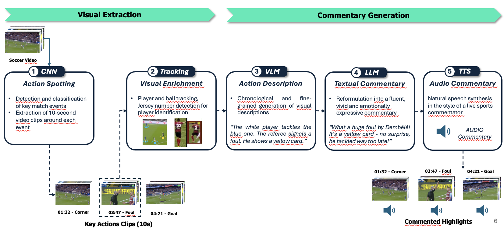

# AI-Generation of Soccer Highlights and Audio Commentaries

This project presents an end-to-end AI pipeline for automatically generating natural audio commentary from raw soccer match videos. Combining the latest advances in Computer Vision, Vision-Language Modeling (VLM), Large Language Models (LLM), and Text-to-Speech (TTS), the pipeline detects key actions, describes them chronologically, reformulates them into sports commentary, and synthesizes spoken audio.

## Context

Generating automated, high-quality soccer commentary from full-match videos is a highly relevant challenge with real-world applications, including YouTube highlights, automated post-match reporting, and textual recaps for sports media like L’Équipe. However, current multimodal AI models face limitations that prevent end-to-end solutions: video inputs must be drastically reduced due to token and memory constraints, and existing Vision-Language Models (VLMs) lack fine temporal understanding, narrative coherence, and emotional tone.

To address this, we designed a modular and scalable pipeline combining vision, language, and audio generation — tailored to work under hardware constraints, yet easily upgradable as models evolve. Our approach breaks down the problem into specialized steps, allowing for flexible customization (e.g., prompts, FPS, resolution), rapid model replacement, and potential adaptation to other sports like basketball or e-sports. This project demonstrates the feasibility of such a system, offering a valuable foundation for future research and product development in sports analytics, media production, and AI-generated storytelling.

You can watch the full demo of the solution by downloading Final_Demo.mp4

<video src="https://github.com/user-attachments/assets/9ef1e9a8-7c0a-42a7-8ea9-f4ccabebc151" controls width="100%"></video> <video src="https://github.com/user-attachments/assets/5643d22c-89cb-4ca2-a31a-4694f95e1d92" controls width="100%"></video>

  

    <video src="https://github.com/user-attachments/assets/9ef1e9a8-7c0a-42a7-8ea9-f4ccabebc151" controls width="45%"></video>
    <video src="https://github.com/user-attachments/assets/5643d22c-89cb-4ca2-a31a-4694f95e1d92" controls width="45%"></video>
  

## Project Overview
The pipeline consists of 5 main components, described below. \\

### Soccer Data
We used **SoccerNet v2**, a public benchmark dataset for soccer video understanding.

### 1. Action Spotting

### 2. Player Tracking

### 3. Action Description (VLM)

### 4. Textual Commentary (LLM)

### 5. Audio Commentary (TTS)

## Quick Setup and Start

## Contributors
- Antoine Bohin (CentraleSupélec) antoine.bohin@student-cs.fr
- Ilyess Doragh (CentraleSupélec) ilyess.doragh@student-cs.fr
- Mathieu Dujardin (CentraleSupélec) mathieu.dujardin@student-cs.fr
- Logan Renaud (CentraleSupélec / MVA) logan.renaud@student-cs.fr
- 
